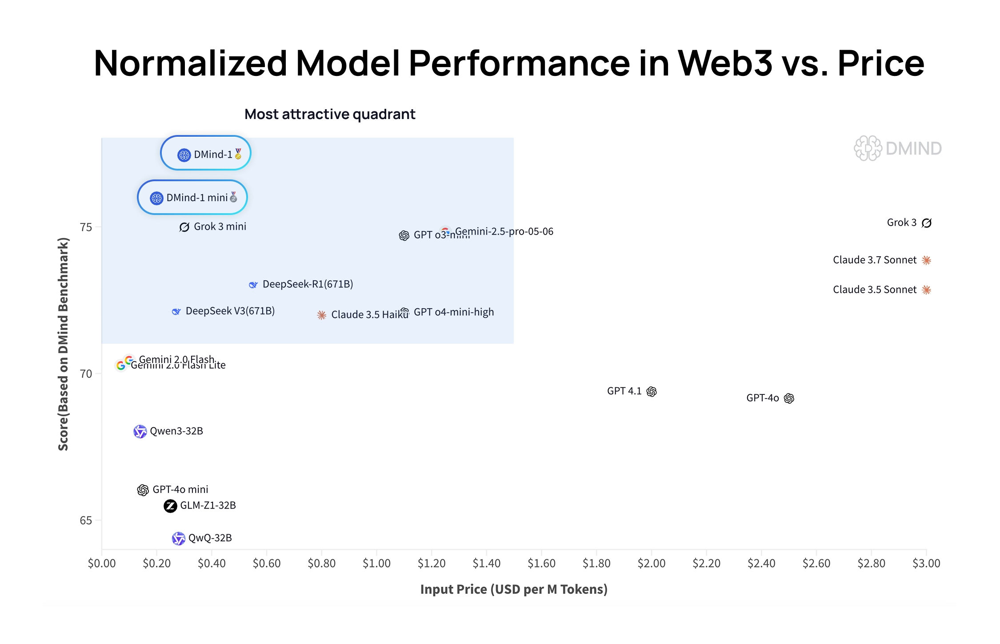

# DMind-1

<div align="center">
  
</div>

<hr>

<div align="center">
    <a href="https://dmind.ai/">
    
  </a>
  <a href="https://huggingface.co/datasets/DMindAI/DMind-1">
    
  </a> 
  <a href="https://x.com/dmind_ai">
    
  </a> 
    <a href="https://openrouter.ai/chat">
    
  </a>
  <a href="https://discord.gg/xxwmPHU3">
    
  </a>
  <a href="https://opensource.org/licenses/MIT">
    
  </a>
  <a href="MODEL-LICENSE">
    
  </a>
  
</div>

## Table of Contents
- [Introduction](#introduction)
- [1. Model Overview](#1-model-overview)
- [2. Evaluation Results](#2-evaluation-results)
- [3. Use Cases](#3-use-cases)
- [4. Quickstart](#4-quickstart)
  - [4.1 Model Downloads](#41-model-downloads)
  - [4.2 OpenRouter API](#42-openrouter-api)
  - [4.3 OpenRouter Web Chat](#43-openrouter-web-chat)
- [License](#license)
- [Contact](#contact)

## Introduction
The rapid growth of Web3 technologies—blockchain, DeFi, and smart contracts—demands specialized AI large language models (LLMs) with precise domain alignment and advanced reasoning capabilities. However, General-purpose LLMs often lack the domain-specific accuracy, nuanced reasoning, and instruction-following aligned with expert expectations. 

To address these limitations, we introduce **DMind-1**, a domain-specialized LLM fine-tuned for the Web3 ecosystem via supervised instruction tuning and reinforcement learning from human feedback (RLHF). Built on a powerful base model, DMind-1 achieves strong improvements in task accuracy, content safety, and expert-aligned interaction, significantly surpassing general-purpose models. DMind-1 represents a robust foundation for intelligent agents in the Web3 ecosystem.

To support real-time and resource-constrained applications, we further release **DMind-1-mini**, a compact variant distilled from both DMind-1 and a generalist LLM using a multi-level distillation framework. It retains key domain reasoning abilities while operating with significantly lower computational overhead.

## 1. Model Overview

### DMind-1
DMind-1 is a specialized Web3 expert model built on the Qwen3-32B base. Leveraging a state-of-the-art transformer architecture, it integrates deep domain knowledge through a novel two-stage fine-tuning pipeline, establishing its distinctive strengths in Web3-specific applications.

**Key Points:**
- **Comprehensive Domain Expertise Data**: In the first stage, DMind-1 underwent Supervised Fine-Tuning (SFT) on 13,276 expert-curated knowledge items distilled from 32.7GB of Web3 documentation, covering 8 key subdomains including DeFi, tokenomics, governance, and smart contracts. These data points were extracted and structured by a team of domain experts to ensure both depth and accuracy. To enable efficient and scalable training, we employed Low-Rank Adaptation (LoRA) during the SFT stage, allowing DMind-1 to internalize specialized Web3 knowledge while preserving the general-language capabilities of its base model.


- **Reinforcement Learning from Human Feedback (RLHF)**
To further align the model with expert expectations in realistic interaction scenarios and accuracy, we implemented an RLHF phase composed of:
    - **Reward Model Training**: We trained a domain-specific reward model using preference-ranked outputs collected from human experts across diverse Web3-specific question-answer and interaction scenarios. This model learned to assess which responses best reflect factual accuracy and expert-level reasoning in the Web3 domain.
    - **Policy Optimization with PPO**: Building on the SFT model, we fine-tuned Qwen3-32B using Proximal Policy Optimization (PPO), guided by the trained reward model. The policy network was optimized based on feedback from simulated Web3 dialogue environments, while LoRA ensured resource-efficient parameter updates and significantly reduced compute and memory requirements. This dual-stage approach enabled efficient fine-tuning of a larger model on Web3-specific tasks while achieving high alignment with human intent.


- **Domain-Aligned Reasoning and Interaction**:
DMind-1 exhibits advanced web3-aligned reasoning and interactive capabilities in the following fields:
    - **Natural Dialogue Fluency**: Coherent, context-aware conversations on complex Web3 topics, with strong multi-turn consistency.

    - **Complex Instruction Following**: Reliable execution of multi-step instructions and conditional logic, supporting agent-driven workflows.

    - **Safe and Compliant Content Generation**: Outputs are aligned with domain-specific safety, ethics, and regulatory standards.

### DMind-1-mini

To address scenarios requiring lower latency and faster inference, we also introduce **DMind-1-mini**, a lightweight distilled version of DMind-1 based on Qwen3-14B.
DMind-1-mini is trained using knowledge distillation and our custom **DeepResearch** framework, drawing from two teacher models:
- **DMind-1** (Qwen3-32B): Our specialized Web3 domain model.
- **GPT-o3 + DeepResearch**: A general-purpose SOTA LLM, with its outputs processed through our DeepResearch framework for Web3 domain alignment.

The **Distillation pipeline** combines:

- **Web3-specific data distillation**: High-quality instruction-following and QA examples are generated by the teacher models

- **Distribution-level supervision**: The student learns to approximate the teachers’ output distributions through soft-label guidance, which preserves nuanced prediction behavior and confidence calibration.

- **Intermediate representation transfer**: Knowledge is further transferred by aligning intermediate representations between teacher and student, promoting deeper structural understanding beyond surface-level mimicry.


This multi-level distillation strategy allows DMind-1-mini to maintain high Web3 task performance with significantly reduced computational overhead and latency, making it suitable for real-time applications such as instant Q&A and on-chain analytics, and lightweight agent deployment.


## 2. Evaluation Results



We evaluate DMind-1 and DMind-1-mini using the [DMind Benchmark](https://huggingface.co/datasets/DMindAI/DMind_Benchmark), a domain-specific evaluation suite designed to assess large language models in the Web3 context. The benchmark includes 1,917 expert-reviewed questions across nine core domain categories, and it features both multiple-choice and open-ended tasks to measure factual knowledge, contextual reasoning, and other abilities.

To complement accuracy metrics, we conducted a **cost-performance analysis** by comparing benchmark scores against publicly available input token prices across 24 leading LLMs. In this evaluation:

- **DMind-1** achieved the highest Web3 score while maintaining one of the lowest token input costs among top-tier models such as Grok 3 and Claude 3.5 Sonnet.

- **DMind-1-mini** ranked second, retaining over 95% of DMind-1’s performance with greater efficiency in latency and compute.

Both models are uniquely positioned in the most favorable region of the score vs. price curve, delivering state-of-the-art Web3 reasoning at significantly lower cost. This balance of quality and efficiency makes the DMind models highly competitive for both research and production use.


## 3. Use Cases
- **Expert-Level Question & Answering**: Provides accurate, context-aware answers on blockchain, DeFi, smart contracts, and related Web3 topics
- **Compliance-Aware Support**: Assists in drafting or reviewing content within regulatory and legal contexts
- **Content Generation in Domain**: Produces Web3-specific blog posts, documentation, and tutorials tailored to developers and users
- **DeFi Strategy Suggestions**: Generates insights and recommendations for yield farming, liquidity provision, and portfolio strategies based on user-provided data
- **Risk Management**: Suggests strategies aligned with user risk profiles for more informed decision-making in volatile markets

## 4. Quickstart

### 4.1 Model Downloads

| **Model**      | **Base Model** | **Download**                                                                 |
|:--------------:|:--------------:|:----------------------------------------------------------------------------:|
| DMind-1        | Qwen3-32B      | [Hugging Face Link](https://huggingface.co/dmind-ai/dmind-1)            |
| DMind-1-mini   | Qwen3-14B      | [Hugging Face Link](https://huggingface.co/dmind-ai/dmind-1-mini)                 |

### 4.2 OpenRouter API

You can access both **DMind-1** and **DMind-1-mini** via the OpenRouter API. Simply specify the desired model in the `model` field of your request payload.

**API Endpoint:**
```
https://openrouter.ai/api/v1/chat/completions
```

**Authentication:**
- Obtain your API key from [OpenRouter](https://openrouter.ai/)
- Include it in the `Authorization` header as `Bearer YOUR_API_KEY`

**Model Identifiers:**
- `dmind-1` — Full-size expert model
- `dmind-1-mini` — Lightweight, faster model

**Example Request (Python):**
```python
import requests

headers = {
    "Authorization": "Bearer YOUR_API_KEY",
    "Content-Type": "application/json"
}

data = {
    "model": "dmind-1",  # or "dmind-1-mini"
    "messages": [
        {"role": "user", "content": "Explain DeFi in simple terms."}
    ]
}

response = requests.post(
    "https://openrouter.ai/api/v1/chat/completions",
    headers=headers,
    json=data
)
print(response.json())
```

**Example Request (cURL):**
```bash
curl https://openrouter.ai/api/v1/chat/completions \
  -H "Authorization: Bearer YOUR_API_KEY" \
  -H "Content-Type: application/json" \
  -d '{
    "model": "dmind-1-mini",
    "messages": [{"role": "user", "content": "What is a smart contract?"}]
  }'
```

**Notes:**
- Replace `YOUR_API_KEY` with your actual OpenRouter API key.
- Change the `model` field to `dmind-1` or `dmind-1-mini` as needed.
- Both models support the same API structure for easy integration.

### 4.3 OpenRouter Web Chat

You can try **DMind-1** and **DMind-1-mini** instantly using the [OpenRouter Web Chat](https://openrouter.ai/chat).

- Select your desired model from the dropdown menu (**DMind-1** and **DMind-1-mini**).
- Enter your prompt and interact with the model in real time.

[](https://openrouter.ai/chat)

## License
- The code repository and model weights for DMind-1 and DMind-1-mini are released under the MIT License.
- Commercial use, modification, and derivative works (including distillation and fine-tuning) are permitted.
- **Base Models:**
  - DMind-1 is derived from Qwen3-32B, originally licensed under the [Qwen License](https://github.com/QwenLM/Qwen3).
  - DMind-1-mini is derived from Qwen3-14B, also under the [Qwen License](https://github.com/QwenLM/Qwen3).
- Please ensure compliance with the original base model licenses when using or distributing derivatives.

## Contact
For questions or support, please contact team@dmind.ai