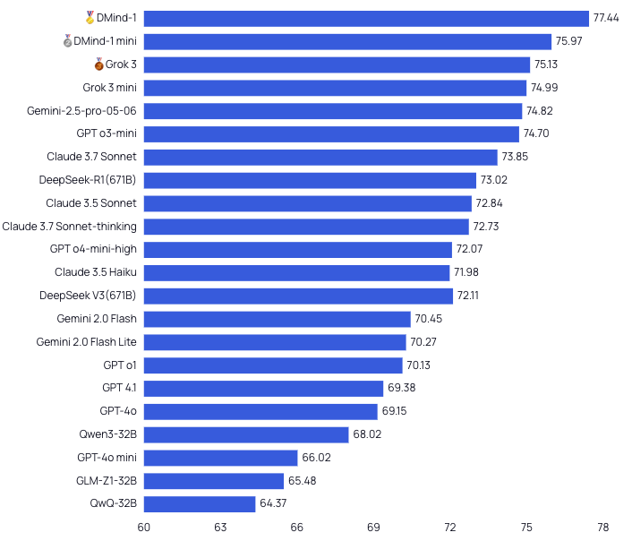

# DMind-1

  

    
   
   
  
  
  

## Table of Contents
- [Introduction](#introduction)
- [1. Model Overview](#1-model-overview)
- [2. Evaluation Results](#2-evaluation-results)
- [3. Use Cases](#3-use-cases)
- [4. Quickstart](#4-quickstart)
  - [4.1 Model Downloads](#41-model-downloads)
  - [4.2 OpenRouter API](#42-openrouter-api)
- [Contact](#contact)

## Introduction
The rapid growth of Web3 technologies—blockchain, DeFi, and smart contracts—demands specialized AI large language models (LLMs) with precise domain alignment and advanced reasoning capabilities. However, General-purpose LLMs often lack the domain-specific accuracy, nuanced reasoning, and instruction-following aligned with expert expectations. 

To address these limitations, we introduce **DMind-1**, a domain-specialized LLM fine-tuned for the Web3 ecosystem via supervised instruction tuning and reinforcement learning from human feedback (RLHF). Built on a powerful base model, DMind-1 achieves strong improvements in task accuracy, content safety, and expert-aligned interaction, significantly surpassing general-purpose models. DMind-1 represents a robust foundation for intelligent agents in the Web3 ecosystem.

To support real-time and resource-constrained applications, we further release **DMind-1-mini**, a compact variant distilled from both DMind-1 and a generalist LLM using a multi-level distillation framework. It retains key domain reasoning abilities while operating with significantly lower computational overhead.

## 1. Model Overview

### DMind-1
DMind-1 is a specialized Web3 expert model built on the Qwen3-32B base. Leveraging a state-of-the-art transformer architecture, it integrates deep domain knowledge through a novel two-stage fine-tuning pipeline, establishing its distinctive strengths in Web3-specific applications.

**Key Points:**
- **Comprehensive Domain Expertise Data**: In the first stage, DMind-1 underwent Supervised Fine-Tuning (SFT) on 13,276 expert-curated knowledge items distilled from 32.7GB of Web3 documentation, covering 8 key subdomains including DeFi, tokenomics, governance, and smart contracts. These data points were extracted and structured by a team of domain experts to ensure both depth and accuracy. To enable efficient and scalable training, we employed Low-Rank Adaptation (LoRA) during the SFT stage, allowing DMind-1 to internalize specialized Web3 knowledge while preserving the general-language capabilities of its base model.

- **Reinforcement Learning from Human Feedback (RLHF)**
To further align the model with expert expectations in realistic interaction scenarios and accuracy, we implemented an RLHF phase composed of:
    - **Reward Model Training**: We trained a domain-specific reward model using preference-ranked outputs collected from human experts across diverse Web3-specific question-answer and interaction scenarios. This model learned to assess which responses best reflect factual accuracy and expert-level reasoning in the Web3 domain.
    - **Policy Optimization with PPO**: Building on the SFT model, we fine-tuned Qwen3-32B using Proximal Policy Optimization (PPO), guided by the trained reward model. The policy network was optimized based on feedback from simulated Web3 dialogue environments, while LoRA ensured resource-efficient parameter updates and significantly reduced compute and memory requirements. This dual-stage approach enabled efficient fine-tuning of a larger model on Web3-specific tasks while achieving high alignment with human intent.

- **Domain-Aligned Reasoning and Interaction**:
DMind-1 exhibits advanced web3-aligned reasoning and interactive capabilities in the following fields:
    - **Natural Dialogue Fluency**: Coherent, context-aware conversations on complex Web3 topics, with strong multi-turn consistency.

    - **Complex Instruction Following**: Reliable execution of multi-step instructions and conditional logic, supporting agent-driven workflows.

    - **Safe and Compliant Content Generation**: Outputs are aligned with domain-specific safety, ethics, and regulatory standards.

### DMind-1-mini

To address scenarios requiring lower latency and faster inference, we also introduce **DMind-1-mini**, a lightweight distilled version of DMind-1 based on Qwen3-14B.
DMind-1-mini is trained using knowledge distillation and our custom **DeepResearch** framework, drawing from two teacher models:
- **DMind-1** (Qwen3-32B): Our in-house Web3 expert model.
- **GPT-o3 + DeepResearch**: A general-purpose SOTA LLM with broad capabilities.

The **Distillation pipeline** combines:

- **Web3-specific data distillation**, using filtered instruction-following and QA samples generated by the teachers

- **Soft-label supervision**, encouraging the student to match the teachers’ output distributions and uncertainty

- **Intermediate representation alignment**, transferring structural knowledge from selected internal layers

This multi-level distillation strategy allows DMind-1-mini to maintain high Web3 task performance with significantly reduced computational overhead and latency, making it suitable for real-time applications such as instant Q&A and on-chain analytics, and lightweight agent deployment.

## 2. Evaluation Results

We evaluate DMind-1 using the **DMind Benchmark**, a domain-specific evaluation suite tailored to assess large language models in the Web3 context. The benchmark spans 1,917 expert-reviewed questions across nine critical categories—including Blockchain Fundamentals, Infrastructure, Smart Contracts, DeFi, DAO, NFT, Token Economics, Meme, and Security. It combines multiple-choice and subjective open-ended tasks, simulating real-world challenges and requiring deep contextual understanding, which provides a comprehensive assessment of both factual knowledge and advanced reasoning.

Under this rigorous evaluation, DMind-1 ranked 1st among 24 leading models, outperforming both proprietary (e.g., Grok-3) and open-source (e.g., DeepSeek-R1) LLMs. Notably, our distilled variant DMind-1-mini also performed strongly, ranking 2nd overall. This demonstrates the effectiveness of our compact distillation pipeline.

## 3. Use Cases
- **Expert-Level Question & Answering**: Provides accurate, context-aware answers on blockchain, DeFi, smart contracts, and related Web3 topics
- **Compliance-Aware Support**: Assists in drafting or reviewing content within regulatory and legal contexts
- **Content Generation in Domain**: Produces Web3-specific blog posts, documentation, and tutorials tailored to developers and users
- **DeFi Strategy Suggestions**: Generates insights and recommendations for yield farming, liquidity provision, and portfolio strategies based on user-provided data
- **Risk Management**: Suggests strategies aligned with user risk profiles for more informed decision-making in volatile markets

## 4. Quickstart

### 4.1 Model Downloads

| **Model**      | **#Total Params** | **#Activated Params** | **Context Length** | **Download**                                                                 |
|:--------------:|:----------------:|:--------------------:|:-----------------:|:----------------------------------------------------------------------------:|
| DMind-1        |               |                   |           | [Hugging Face Link](https://huggingface.co/dmind-ai/dmind-1-base)            |
| DMind-1-mini   |               |                  |            | [Hugging Face Link](https://huggingface.co/dmind-ai/dmind-1)                 |

### 4.2 OpenRouter API
## Contact
For questions or support, please contact team@dmind.ai